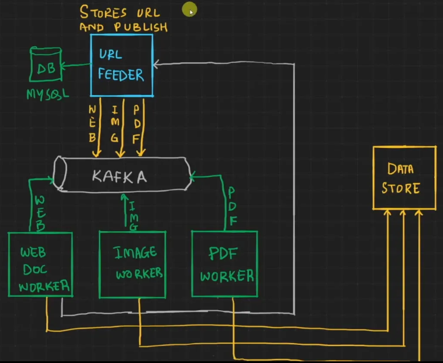

# URLParser
-----------------------------------------------------------------------------------------------------------------------------------------------------------------
A springboot Powered Url parser , in a microservices architechture, that parses the content of url - web, image, pdf. It has 4 micro services, one to read the input url and other as workers to parse the content of the url. The services are loosely  coupled and leveraging kafka as a message broker between services.. It uses, MYSQL, and MongoDB as databases. MYSQL to store urls that are processed. MongoDB to store the content of url. It uses, redis at database level for caching.It is confgured with ZUUL for api gateway and netflix-eurka for service discovey. the whole application is containerized using docker. Future prospects it to add Kubernetes to make it scalable. This project Aims at covering the Breadth of services and Technologies , while it comes to build a mini real world microservices based application.
-----------------------------------------------------------------------------------------------------------------------------------------------------------------

